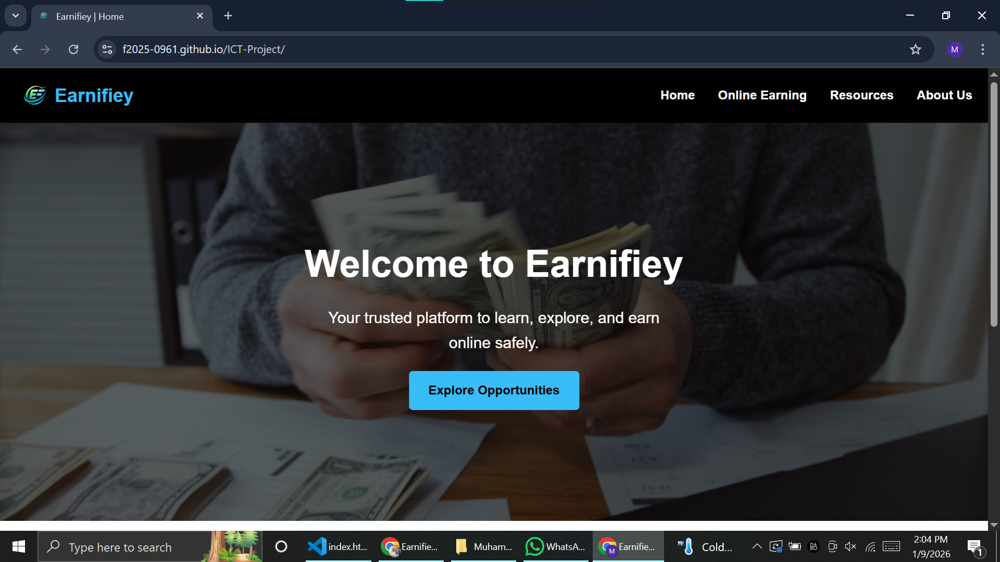
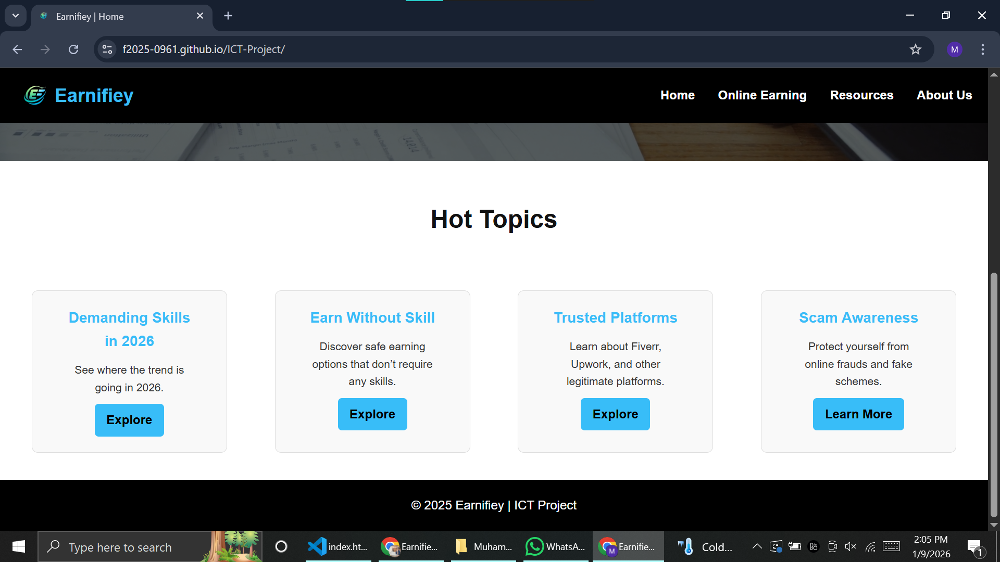
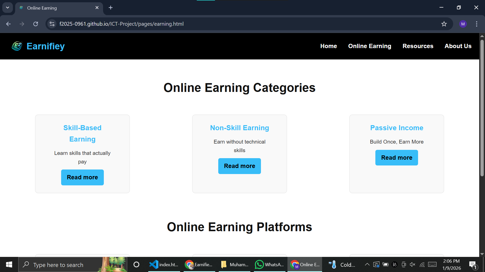
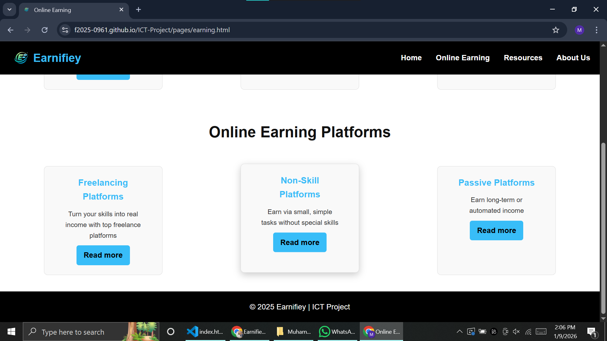
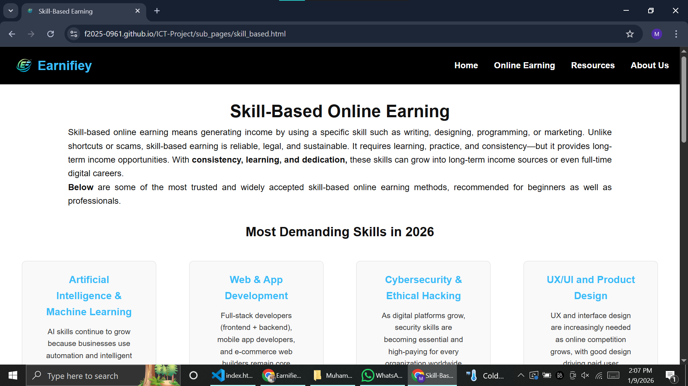
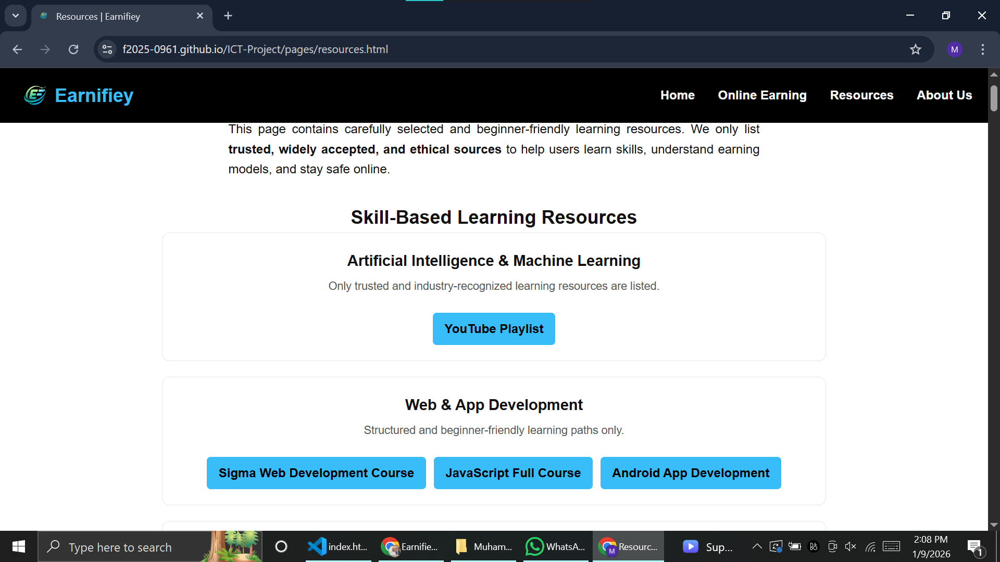
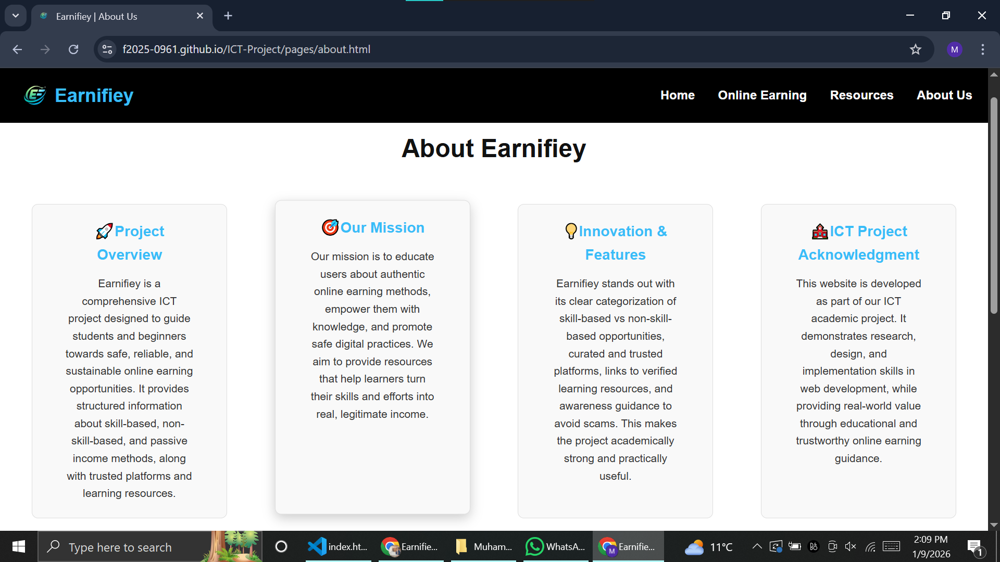
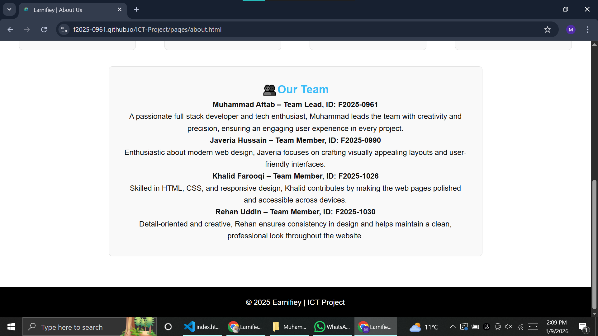

# 🌐 Earnifiey – Trusted Online Income Guide

## 📖 Project Overview
**Earnifiey** is an ICT academic project focused on researching, organizing, and presenting **trusted and legitimate online income sources** in a structured and beginner-friendly way.

The aim of this project is to guide users by providing:
- Research-based information
- Clear learning roadmaps
- Required skills for each income source
- Trusted and authentic learning resources

Earnifiey is designed for **students, beginners, and individuals** who want to start earning online through **legitimate and verified methods only**.

---

## 🎯 Core Theme & Concept
The core concept of **Earnifiey** is:

> **Research and guidance for legitimate online earning opportunities**

We researched multiple online income sources and divided them into:
- **Main Categories**
- **Sub-Categories**
- **Dedicated Blog Pages**

Each blog page contains:
- Explanation of the earning method
- How it works
- Required skills
- Step-by-step learning roadmap
- Trusted and authentic resources

No fake, scam, or unverified earning methods are included.

---

## 🗂️ Website Structure
The website follows a clear and logical structure:

- Home Page  
- Main Categories  
- Sub-Categories  
- Blog Pages with complete roadmaps and trusted resources  

This structure ensures clarity, easy navigation, and educational value.

---

## 🛠️ Technologies Used
- **HTML5**
- **CSS3**
- **Git & GitHub**

---

## 🤝 Team Collaboration & Leadership
This project was developed using **GitHub** for version control and collaboration.

GitHub was used for:
- Version management
- Team collaboration
- Commit history
- Code merging

👨‍💼 **Role: Team Lead**  
I worked as the **Team Lead**, managing the project structure, coordinating tasks, reviewing code, and ensuring smooth collaboration among team members.

The team collaborated efficiently and followed proper GitHub practices.

---

## 🖼️ Project Screenshots

All screenshots are stored in a folder named **`Screenshots`** and are displayed below **in correct numeric order**.

### 📁 Screenshots Folder Structure

---

### 📸 Website Preview

| | |
|---|---|
|  |  |
|  |  |
|  |  |
|  |  |
|  |  |

---

## 🚀 How to Run the Project
1. Clone or download the repository  
   ```bash
   git clone <repository-url>
